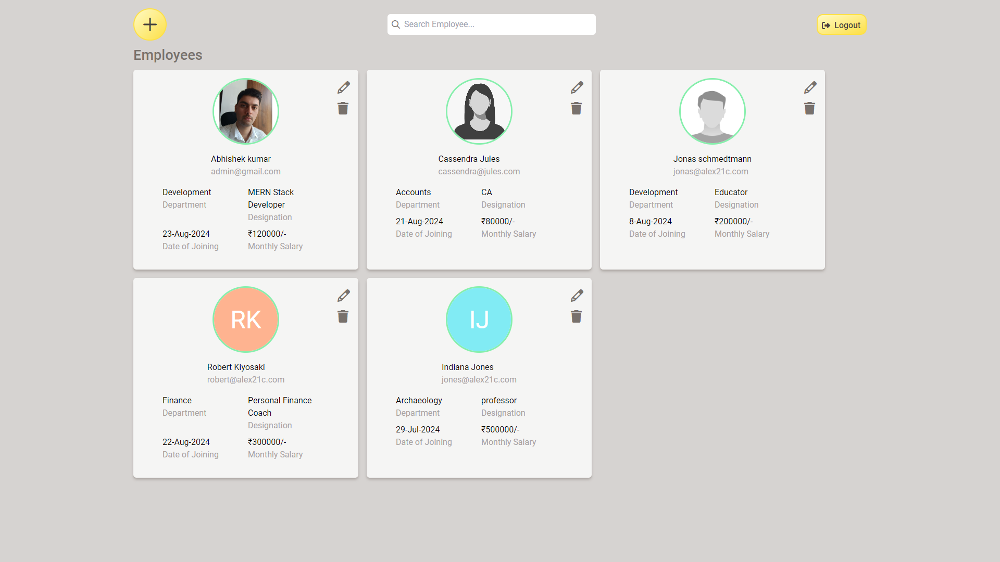

# Skyniche employees cards assignment


## Hosted Link
[skyniche-employees-cards-assignment](https://skyniche-employees-cards-assignment.vercel.app/)

## Objective
Build a MERN Stack application where employees details can be managed, allowing adding new employees, updating existing employee details, Searching and deleting employees.

## Assignment Specs:
+ Created and display a modal when user click on the plus icon. 
The popup form have fields to enter First Name, Last Name, Department, Designation, Date of Joining, Salary. It ise optional to upload the image as well. If the image is not uploaded then the image circle shows the first letters in first name and last name of employees.. 
+ created the followingAPIs using NodeJS to make the application interactive with the user.
   1. Create / Add New Employee
   2. Read / Select Employee(s)
      (a) API to select data from database table using id (a unique value or primary key) 
      (b) API to select all the data stored in database table
      (c) API to search data based on the parameter given by the user. For example: based on "name of employee", "designation" etc.
  3. Update / Edit Employee Details
  4. Delete / Remove Employee

## Tech. Stack Used:
- [MongoDB](https://www.mongodb.com/)
- [ExpressJS](https://expressjs.com/)
- [ReactJS](https://react.dev/)
- [NodeJS](https://nodejs.org/en/)
- [JWT Authentication](https://jwt.io/)
- [Cloudinary](https://cloudinary.com/)
  

## How to install and run in yours local machine
### .env file front End
```javascript
REACT_APP_SERVER_ROOT_URL=http://localhost:4000
REACT_APP_PROJECT_NAME=alex21c-skyniche-employees-cards-assignment
REACT_APP_MAX_ALLOWED_PROFILE_IMAGE_SIZE_IN_KB=500
```
### .env file back End
```javascript
PORT=4000
MONGODB_CONNECTION_STRING=mongodb://localhost:27017/skyniche-employees-cards-assignment
JWT_PRIVATE_KEY=skyniche-employees-cards-assignment-private-key-created-on-17-aug-2024
USER_SESSION_EXPIRES_AFTER="1d"
CLOUDINARY_CLOUD_NAME=
CLOUDINARY_API_KEY=
CLOUDINARY_API_SECRET=
MAX_ALLOWED_FILE_UPLOAD_SIZE_IN_KB=500
PRJ_NAME=skyniche-employees-cards-assignment
```
Note: 
+ YoursMongoDBConnectionString : get yours from [www.mongodb.com](https://www.mongodb.com/)
+ YoursCloudinaryApiKey : get yours from [cloudinary.com](https://cloudinary.com/)


```bash
npm install
npm run start
```


## API Endpoints

### Download Postman endpoints file 
+ [postman-api-endpoints.json](postman-api-endpoints.json)
   
### Server Base URL 
```bash
LOCALHOST=http://localhost:4000
RENDER=https://skyniche-employees-cards-assignment.onrender.com
```

## 1. User Endpoints
### 1.1 POST api/v1/user/registerNewUser
### Purpose:
Create new User Account (Admin), using this account new employees can be added, modified or removed.
### Request Body:
```javascript
JSON BODY
{
  "username": "alex21c",
  "firstName": "Abhishek",
  "lastName": "kumar",
  "email": "admin@alex21c.com",
  "mobile": "8278782787",
  "password": "admin123"
}

```
### Response Success:
```javascript
JSON
{
    "success": true,
    "Authorization": "Bearer JWT_TOKEN"
}
```
### 1.2 POST api/v1/user/login
### Purpose:
Sign In User
### Request Body:
```javascript
JSON BODY
{
  "usernameOrEmailOrMobile": "alex21c",
  "password": "admin123"
}
```
### Response Success:
```javascript
JSON
{
    "success": true,
    "Authorization": "Bearer JWT_TOKEN"
}
```
### 1.3 GET /api/v1/user/handshake-hello
### Purpose:
Render Server Free instance spin off if inactive, this request instance to be active once again
### Request Body:
NA

### Response Success:
```javascript
JSON
{
    "success": true,
    "message": "hi there!"
}
```


## 2. Employee Endpoints
### 2.1 POST /api/v1/employee/register-new-employee
### Purpose:
Create a New Employee and store details into the MongoDB Database.
### Request Body:
```javascript
HEADERS
"Authorization": "Bearer JWT_TOKEN"

BODY FORM-DATA
fieldName | Type | Sample Value
firstName | Text | Abhishek
lastName | Text | kumar
email | Text | admin@alex21c.com
department | Text | Development
designation | Text | SDE
dateOfJoining | Text | 17-Aug-2024
monthlySalary | Text | 120000
profileImage | File | profileImage.png


```
### Response Success:
```javascript
JSON
{
    "success": true,
    "data": {
        "firstName": "Abhishek5",
        "lastName": "kumar",
        "email": "admin@alex21c.com",
        "department": "Development",
        "designation": "SDE",
        "dateOfJoining": "2024-08-16T18:30:00.000Z",
        "monthlySalary": 120000,
        "salaryCurrency": "₹",
        "_id": "66c9ac934e65806d9b7d04ad"
    }
}
```
### 2.2 GET /api/v1/employee/get-employee-by-id/:employeeId
### Purpose:
Search for specific employee matching provided employeeId and return information about employee if present
### Request Body:
```javascript
HEADERS
"Authorization": "Bearer JWT_TOKEN"

Request
/api/v1/employee/get-employee-by-id/66c9acde4e65806d9b7d04b0

```
### Response Success:
```javascript
JSON
{
    "success": true,
    "data": {
        "_id": "66c9acde4e65806d9b7d04b0",
        "firstName": "Jane",
        "lastName": "Smith",
        "email": "jane@alex21c.com",
        "department": "Accounts",
        "designation": "CA",
        "dateOfJoining": "2024-08-16T18:30:00.000Z",
        "monthlySalary": 180000,
        "salaryCurrency": "₹",
        "__v": 0
    }
}
```
### 2.3 GET /api/v1/employee/get-all-the-employees
### Purpose:
Get all the employees present in the Database
### Request Body:
```javascript
HEADERS
"Authorization": "Bearer JWT_TOKEN"

```
### Response Success:
```javascript
JSON
{
    "success": true,
    "data": [
        {
            "_id": "66c9ac934e65806d9b7d04ad",
            "firstName": "Abhishek5",
            "lastName": "kumar",
            "email": "admin@alex21c.com",
            "department": "Development",
            "designation": "SDE",
            "dateOfJoining": "2024-08-16T18:30:00.000Z",
            "monthlySalary": 120000,
            "salaryCurrency": "₹",
            "__v": 0
        },
        {
            "_id": "66c9acde4e65806d9b7d04b0",
            "firstName": "Jane",
            "lastName": "Smith",
            "email": "jane@alex21c.com",
            "department": "Accounts",
            "designation": "CA",
            "dateOfJoining": "2024-08-16T18:30:00.000Z",
            "monthlySalary": 180000,
            "salaryCurrency": "₹",
            "__v": 0
        }
    ]
}
```
### 2.4 GET api/v1/employee/get-employees-based-on-custom-filters?firstName=value&lastName=null&department=null&designation=null
where,
+ value: could be any first name like abhishek,
+ null: specify that ignore that attribute
### Purpose:
Search for employee based on custom filter if either of firstName, lastName, department, designation matches that employee record is returned, if multiple employees having smiliar information all of them would be returned
### Request Body:
```javascript
HEADERS
"Authorization": "Bearer JWT_TOKEN"

Request :
api/v1/employee/get-employees-based-on-custom-filters?firstName=jane&lastName=null&department=null&designation=null

```
### Response Success:
```javascript
JSON
{
    "success": true,
    "data": [
        {
            "_id": "66c9acde4e65806d9b7d04b0",
            "firstName": "Jane",
            "lastName": "Smith",
            "email": "jane@alex21c.com",
            "department": "Accounts",
            "designation": "CA",
            "dateOfJoining": "2024-08-16T18:30:00.000Z",
            "monthlySalary": 180000,
            "salaryCurrency": "₹",
            "__v": 0
        }
    ]
}
```
### 2.5 PATCH api/v1/employee/update-employee-details
### Purpose:
Update existing employee details stored inside the MongoDB Database. Here developer can specify all the fields that needed to be changed or just specific fields only.

### Request Body:
```javascript
HEADERS
"Authorization": "Bearer JWT_TOKEN"

BODY FORM-DATA
fieldName | Type | Sample Value
employeeId | Text | 66c9acde4e65806d9b7d04b0
firstName | Text | Jane
lastName | Text | 
email | Text | 
department | Text | 
designation | Text | 
dateOfJoining | Text | 
monthlySalary | Text | 
profileImage | File | profileImage.png


```
### Response Success:
```javascript
JSON
{
    "success": true,
    "msg": "wait",
    "data": {
        "_id": "66c9acde4e65806d9b7d04b0",
        "firstName": "Jane 2",
        "lastName": "Smith",
        "email": "jane@alex21c.com",
        "department": "Accounts",
        "designation": "CA",
        "dateOfJoining": "2024-08-16T18:30:00.000Z",
        "monthlySalary": 180000,
        "salaryCurrency": "₹",
        "__v": 0
    }
}
```
### 2.6 DELETE api/v1/employee/delete-employee
### Purpose:
Permanently delete the employee from MongoDB database, and if there is any profile image associated with empoyee then delete that as well from cloudinary server

### Request Body:
```javascript
HEADERS
"Authorization": "Bearer JWT_TOKEN"

BODY JSON
{
    "employeeId" : "66c9acde4e65806d9b7d04b0"
}


```
### Response Success:
```javascript
JSON
{
    "success": true,
    "data": "Employee record deleted !"
}
```


## Author

[Abhishek kumar](https://www.linkedin.com/in/alex21c/), ([Geekster](https://geekster.in/) MERN Stack FS-14 Batch)
